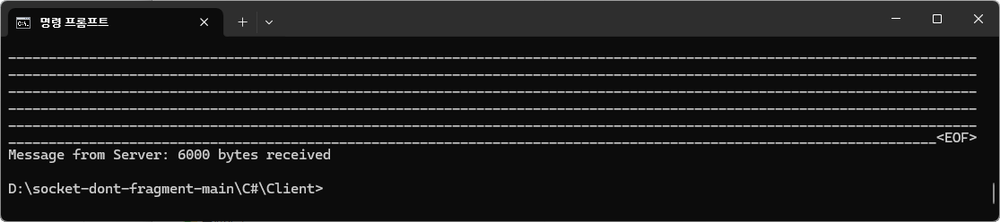

# C# Socket Client 실행

## Windows 11 기준

### .NET 설치

1. .NET 다운로드 사이트에 접속하여 .NET SDK를 다운로드 받습니다.

    - https://dotnet.microsoft.com/en-us/download

2. 다운받은 설치파일을 실행하여, 설치합니다.

3. 설치가 완료되면, 윈도우즈에서 CMD 명령 프롬프트를 실행합니다.

4. dotnet 명령어가 실행되는지, 다음 명령으로 설치확인을 합니다. 설치시점에 따라 버전명은 달라질수 있습니다.

    ```
    $ dotnet --version
    8.0.301
    ```

### Socket Client 실행

1. 실행할 소스코드를 다운로드 받습니다.

    - https://github.com/TheKoguryo/socket-dont-fragment/archive/refs/heads/main.zip

2. 다운로드 받은 파일의 압축을 해제합니다.

3. 윈도우즈에서 CMD 명령 프롬프트를 실행합니다.

4. 압축해제된 파일의 하위 폴더인 C# > Client 폴더로 이동합니다.

    ```
    cd C#\Client
    ```

5. 테스트 서버에 다음 명령으로 접속합니다.

    - Socket Client의 경우 `DONT-FRAGMENT 사용여부`는 지정하지 않는 경우 디폴트는 true입니다. 

        ```
        dotnet run <SERVER-IP> <PORT> <DONT-FRAGMENT 사용여부>
        ```

    - 실행예시

        ```
        dotnet run 150.xxx.xxx.xx 8080

        또는 
        
        dotnet run 150.xxx.xxx.xx 8080 true
        ```

6. `Message from Server: 6000 bytes received`와 같이 Socket Server가 보낸 메시지를 수신하면, 정상적으로 통신이 된 것입니다. 

    


